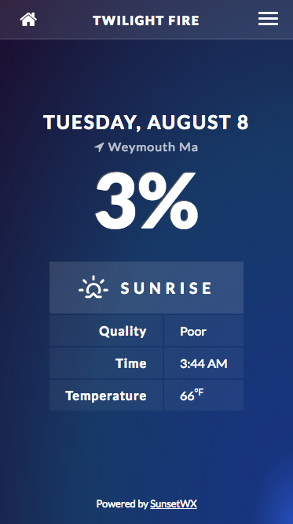

# TwilightFire

## Table of Contents
 - [Introduction](#introduction)
 - [Features](#features)
 - [Tasks](#tasks)

## Introduction
TwilightFire is an app based off of [SunsetWX](https://sunsetwx.com/)that predicts the vibrance of the next sunset or sunrise by using the user's current location or by filling in the city, ST.
The higher the percentage the more vibrant the sun event will be.
This is especially helpful for photographers or even runner who want to catch the natural beauty of the sky.

### Features
  - HTML
  - Javascript
  - JQuery
  - Npm
  - gulp
  - Sass
  - API

## API
See [API](https://sunburst.sunsetwx.com/v1/docs/).

### Tasks
#### Basic Tasks
- [x] Set up state
- [x] Get API (backend) working
- [x] Pull in basic API info from backend
- [x] Should include: location, coords, sunType, forecast (date, time, quality percent, quality text, temperature), currentPage: 'pageHome', loadingText
- [x] Move from homepage form to results page with form submission
- [x] Create second form on results page to change search info

#### Tasks for Code
- [x] Set up state
- [x] Get location from GPS (geolocation)
  - [ ] have lat/long change to city, state @joelwallis
  - [x] have location fill in input (put in as "current location" for now but will create a conversion in future)
  - [x] if i cant change coords --> city state without getting to api -- figure out work a round for now
- [x] Pull in basic API info from backend
- [x] change location/sun event on results page-results
- [x] go back to home button and reset state
- [x] get rid of seconds in the time on results page
- [x] fix location of home button on safari
- [x] create a clear button for form - helpful for when coordinates have been found

#### Tasks for Design
- [x] Set up gulp
- [x] Sketch our wireframes
- [x] Make everything responsive (mobile first)
- [x] Background color should be warmer the nicer the quality & cooler on lower quality
- [x] Add text that this only works for the lower 48
- [x] Add sunrise/sunset icons to results page
- [x] Bring more prominence to the DAY of the week to relieve some confusion
